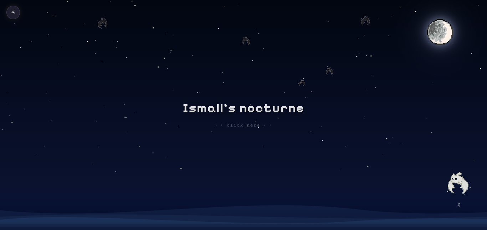
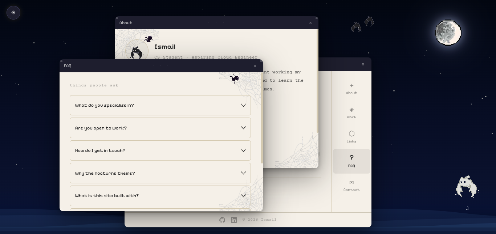

# *My nocturne* 🌃
My personal portfolio website built with Vite + React

### *Link*: [ismail's-nocturne](https://ismails-nocturne.vercel.app/)

## Preview

### Video

### Gallery
| Preview 1 | Preview 2 | Preview 3 |
|-----------|-----------|-----------|
|  |  |  |

| Preview 4 | Preview 5 |
|-----------|-----------|
|  |  |

## Things Learned
Planning animations before coding saved a lot of time

- React component architecture & state management  
- CSS animations and transitions (pixel bats flying, moon, clouds, paper plane)  
- Responsive design for desktop & mobile  
- Deploying to Vercel  
- Handling media & sound effects in web apps  
- Organizing a personal project repository  